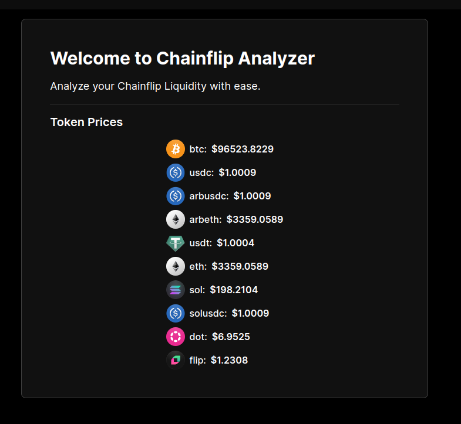
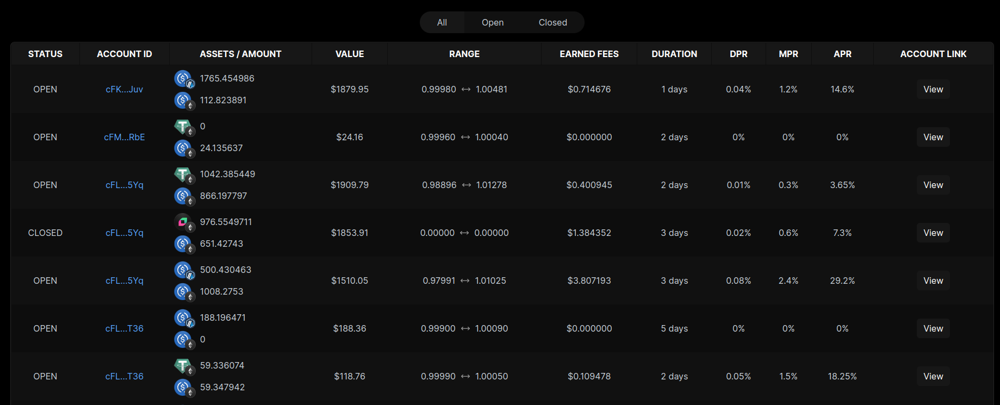

# Chainflip Analyzer Web App

Chainflip Analyzer is a web application that provides detailed analysis and insights into liquidity pools and token prices on the Chainflip platform.

## Features

- Fetches and displays token prices from various chains
- Calculates and displays liquidity pool metrics such as DPR, MPR, and APR
- Provides a detailed view of pool orders with relevant metrics

## Documentation

[**Demo**](https://cfa.shariat.de): you can see the real-time data on my website

For detailed calculation logic and methodologies, refer to the following files:

- [Liquidity Pool Metrics Logic](./app/docs/range-order-calculation.md): Explains the logic of range order calculation APR, DPR, MPR, etc.
- [Token Prices](./app/docs/getAllTokenPrices.md): Explains the logic for fetching and mapping token prices.
- [GraphQL Queries](./app/docs/graphql.md): Contains the GraphQL queries used to fetch data.

## Installation

1. Clone the repository to your local machine:

   ```sh
   git clone https://github.com/payamss/chainflip-analyzer.git
   ```

2. Navigate to the project directory:

   ```sh
   cd chainflip-analyzer
   ```

3. Install the dependencies:

   ```sh
   npm install
   ```

4. Start the development server:

   ```sh
   npm run dev
   ```

## Usage

1. Open your browser and navigate to `http://localhost:3000`.

2. Use the navigation menu to explore different sections of the app.

3. View token prices, pool orders, and other metrics.

## Screenshots

### Token Prices

<div align="center">
  
</div>

### Range Orders

<div align="center">
  
</div>

## License

This project is licensed under the MIT License. See the LICENSE file for details.
